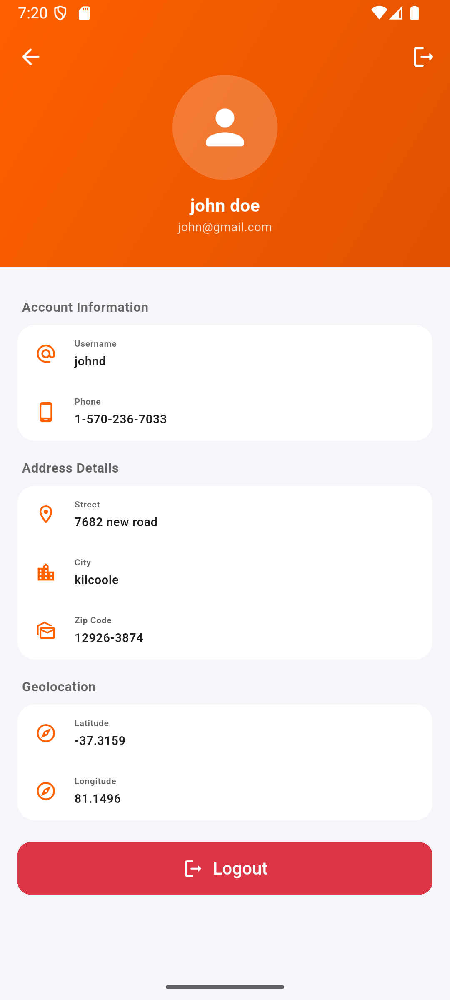

# 🛍️ Daraz Product Listing & Profile App

A high-performance Flutter application mimicking the **Daraz** e-commerce experience. This project demonstrates advanced UI techniques, including a seamless single-scroll product listing, sophisticated shimmering loading states, and a fully realized user profile system.

---

## 📸 Screenshots & Demo

### 🖼️ App Previews
| Login Screen | Profile Screen |
| :---: | :---: |
|  |  |

| Product Listing (View 1) | Product Listing (View 2) |
| :---: | :---: |
|  |  |

### 📹 Screen Recording
Experience the smooth transitions and loading effects in action:
**[View Screen Recording](screen_video.mp4)**

---

## ✨ Core Features

- **🚀 Single-Scroll Architecture**: Optimized product listing using a single `CustomScrollView` to eliminate scroll conflicts and ensure a fluid 60FPS experience.
- **✨ Premium Shimmering Effects**: Integrated `Skeletonizer` for beautiful, modern loading states across the Entire Home and Profile screens.
- **🔐 Secure Authentication**: Full Login/Logout flow with real-time field validation and local storage integration.
- **👤 Dynamic User Profile**: Fetches and displays detailed user information, including account details, addresses, and geolocation, using the **FakeStore API**.
- **🛍️ Intelligent Product Feed**: Categorized product listings with real-time filtering, discount calculation, and "Daily Deals" sections.
- **🎨 Modern UI/UX**: Premium design aesthetics featuring gradients, micro-animations, and a consistent design system (`AppColors`, `AppSizes`, `AppStrings`).

---

## 🛠️ Tech Stack

- **Framework**: [Flutter](https://flutter.dev/)
- **State Management**: [GetX](https://pub.dev/packages/get)
- **API**: [FakeStoreAPI](https://fakestoreapi.com/)
- **Shimmer/Skeleton**: [Skeletonizer](https://pub.dev/packages/skeletonizer)
- **Storage**: `GetStorage`
- **Networking**: `http` with automated error handling.

---

## 📋 Mandatory Explanations

### 1. How horizontal swipe was implemented
The horizontal swipe was implemented by fully decoupling the gesture detection from the standard `TabBarView` or `PageView` (which naturally wrap ListViews). 
Instead, the *entire* screen is wrapped in a `GestureDetector` that listens exclusively to `onHorizontalDragUpdate` and `onHorizontalDragEnd`. The grid items in the active category are wrapped inside a `Transform.translate` widget driven by an `AnimationController`. 
When the user swipes left or right:
- The delta offset instantly updates the `dx` of the grid items, moving them synchronously along the horizontal X-axis.
- Upon releasing the drag (`onHorizontalDragEnd`), if the velocity or distance surpasses a threshold (one-third of the screen width), the `AnimationController` animates the list off-screen.
- The state index natively snaps to the next tab, the data source updates to the newly selected category's products, and the translation offset is instantly reset to `0.0`, rendering the new products perfectly in view.

### 2. Who owns the vertical scroll and why
The **`CustomScrollView` uniquely and entirely owns the vertical scroll**. 
Unlike traditional implementations that nest a `TabBarView` inside a `NestedScrollView` (which fundamentally spawns inner Scrollables for each tab, creating infamous "scroll conflict" or state loss bugs), this architecture employs only one top-level sliver scroll mechanism.
- `SliverAppBar` manages the collapsible header.
- `SliverPersistentHeader` pins the TabBar correctly based on vertical offset.
- `SliverGrid` pushes raw items directly into the vertical scroll math.
Since the list changes only data (not internal widgets) on horizontal tab switching, the pixel offset is universally shared across the active dataset. Thus, switching tabs guarantees absolute zero jump in vertical positioning, and there can fundamentally be zero scroll conflicts.

### 3. Trade-offs or limitations of your approach
1. **Side-by-side transition limitation**: Since the `SliverGrid` only renders the *currently selected* tab data at a time to retain single-scroll math, sliding during the transition only shows the active list moving off-screen. It does not natively show the incoming list sliding seamlessly *into* screen parallel to it simultaneously. To achieve genuine side-by-side sliding inside a single sliver, one would have to fetch and compose a complex horizontal Stack of both data lists row-by-row during the animation frame cycle.
2. **Infinite gesture catching**: The `GestureDetector` wraps the *whole* scroll area. This works excellently for this core view. However, if any sub-widget inside the product grid demands its own horizontal gestures (e.g., a horizontal image carousel inside a single product card), that sub-widget will explicitly fight or absorb the parent `GestureDetector`'s events unless explicitly scoped via hit testing. 

---

## 🚀 Run Instructions

```bash
flutter pub get
flutter run
```
